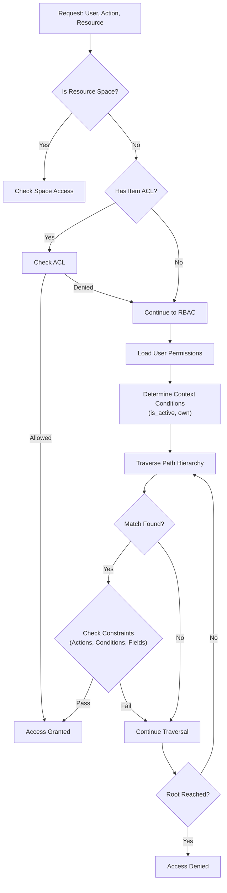

# D-MART Access Control Technical Documentation

This document provides a deep technical overview of the Access Control system in D-MART, intended for backend developers. The system implements a hybrid model combining **Role-Based Access Control (RBAC)** for broad permissions and **Access Control Lists (ACLs)** for fine-grained, resource-specific overrides.

## Core Architecture

The access control logic is centralized in `backend/utils/access_control.py` within the `AccessControl` class. Data models are defined in `backend/models/core.py`.

### Key Components

1.  **Permission (`models.core.Permission`)**: The atomic unit of access. It defines *what* can be done on *which* resources under *what* conditions.
2.  **Role (`models.core.Role`)**: A named collection of Permission shortnames.
3.  **Group (`models.core.Group`)**: A named collection of Roles. Users are assigned to Groups.
4.  **User (`models.core.User`)**: The actor. Can have direct Roles and inherit Roles from Groups.
5.  **ACL (`models.core.ACL`)**: An optional list embedded directly in a Resource (`Meta` class) that grants specific users specific actions, bypassing the standard RBAC flow.

## The Authorization Algorithm (`check_access`)

The `AccessControl.check_access` method is the gatekeeper. It evaluates requests based on the following precedence order:



### Detailed Evaluation Steps

#### 1. ACL Evaluation (Short-Circuit)
Before evaluating roles, the system checks if the specific resource instance has an **Access Control List (ACL)** defined.
-   **Method**: `check_access_control_list`
-   **Logic**: If `entry.acl` exists and contains an entry for `user_shortname` with the requested `action_type`, access is **immediately granted**.
-   **Note**: ACLs are strictly *additive*. They cannot explicitly deny access if a Role allows it, but they are checked *before* Roles, allowing for performance optimization on specific items.

#### 2. Permission Aggregation
If no ACL grants access, the system compiles the user's effective permissions.
-   **Source**: User's direct Roles + Roles from User's Groups.
-   **Storage**: Permissions are flattened and stored in Redis for fast lookup.

#### 3. Contextual Conditions (`ConditionType`)
The system determines the "state" of the request to match against Permission conditions.
-   **`is_active`**: Set if the resource's `is_active` flag is True.
-   **`own`**: Set if `resource.owner_shortname == user.shortname` OR `resource.owner_group` is in `user.groups`.

#### 4. Hierarchy Traversal & Global Wildcards
The system checks permissions starting from the specific resource path up to the root.
-   **Path**: `/space/folder/subfolder/resource`
-   **Traversal Order**:
    1.  Specific Path: `space:/folder/subfolder/resource`
    2.  Parent: `space:/folder/subfolder`
    3.  ...
    4.  Root: `space:/`
-   **Wildcard Checks (`has_global_access`)**: At each level, it also checks for magic words:
    -   `__all_spaces__`: Grants access across all spaces.
    -   `__all_subpaths__`: Grants access to any subpath.

#### 5. Constraint Validation
When a matching Permission key is found, three checks must pass:
1.  **Action Check**: Is `action_type` (e.g., `view`, `create`) in `allowed_actions`?
2.  **Condition Check (`check_access_conditions`)**:
    -   Does the Permission require conditions (e.g., `own`)?
    -   If yes, does the current Context (Step 3) satisfy them?
    -   *Example*: A user can only `update` a ticket if they `own` it.
3.  **Field-Level Restrictions (`check_access_restriction`)**:
    -   **Restricted Fields**: For `update`/`create`, ensures the user is not modifying fields listed in `restricted_fields` (e.g., `status`, `owner`).
    -   **Allowed Values**: Checks if the values being assigned to fields match `allowed_fields_values`.

#### 6. User Profile Protection
For User Profile updates (`user` resource type), an additional layer of protection exists via the `user_profile_payload_protected_fields` setting in `backend/utils/settings.py`. This global setting prevents users from modifying specific fields in their own profile payload, even if their Role technically allows "update" access.

## Permission JSON Structure

Permissions are defined as JSON objects. Understanding these keys is critical for configuring access.

### Important Keys

| Key | Type | Description |
| :--- | :--- | :--- |
| **`subpaths`** | `dict[str, list[str]]` | **Target Scope**. Maps Space names to a list of subpaths. <br>Use `__all_subpaths__` for recursive access.<br>Use `__all_spaces__` as the key for global access. |
| **`resource_types`** | `list[str]` | **Target Resources**. The types of objects this permission applies to (e.g., `["content", "ticket", "user"]`). Matches `backend/models/enums.py::ResourceType`. |
| **`actions`** | `list[str]` | **Allowed Operations**. What the user can do (e.g., `["create", "view", "update", "delete", "query"]`). Matches `backend/models/enums.py::ActionType`. |
| **`conditions`** | `list[str]` | **Contextual Requirements**. <br>`"own"`: User must be the owner of the resource.<br>`"is_active"`: Resource must be active.<br>Empty list `[]` implies no special conditions (broad access). |
| **`restricted_fields`** | `list[str]` | **Field Protection**. Fields that *cannot* be modified in `create` or `update` requests. Useful for protecting system fields like `is_active` or `roles`. |
| **`allowed_fields_values`** | `dict[str, list]` | **Value Constraints**. Enforces that specific fields can only take specific values. <br>*Example*: `{"status": ["open", "closed"]}`. |

### Example: "Super Manager" Permission
*From `sample/spaces/management/permissions/.dm/super_manager/meta.permission.json`*
*(Note: JSON comments are added for explanation and are not standard JSON)*

```json
{
  "shortname": "super_manager",
  "subpaths": {
    "__all_spaces__": [
      "__all_subpaths__"  // Grants access to EVERYTHING everywhere
    ]
  },
  "resource_types": [
    "schema", "space", "content", "user", ... // All types
  ],
  "actions": [
    "delete", "update", "query", "create", "view", "attach" // Full control
  ],
  "conditions": [], // No "own" requirement -> Can edit other people's data
  "restricted_fields": [] // Can edit ANY field
}
```

### Example: "View Users" Permission
*From `sample/spaces/management/permissions/.dm/view_users/meta.permission.json`*

```json
{
  "shortname": "view_users",
  "subpaths": {
    "management": [
      "users" // Only applies to the 'users' path in 'management' space
    ]
  },
  "resource_types": [
    "content", "ticket", "folder"
  ],
  "actions": [
    "view", "query" // Read-only access
  ],
  "conditions": []
}
```

### Example: Restricted Update (Conceptual)

```json
{
  "shortname": "edit_own_profile",
  "resource_types": ["user"],
  "actions": ["update"],
  "conditions": ["own"], // Can only edit THEIR OWN user record
  "restricted_fields": ["roles", "is_active"], // Cannot promote themselves or disable/enable accounts
  "allowed_fields_values": {}
}
```
