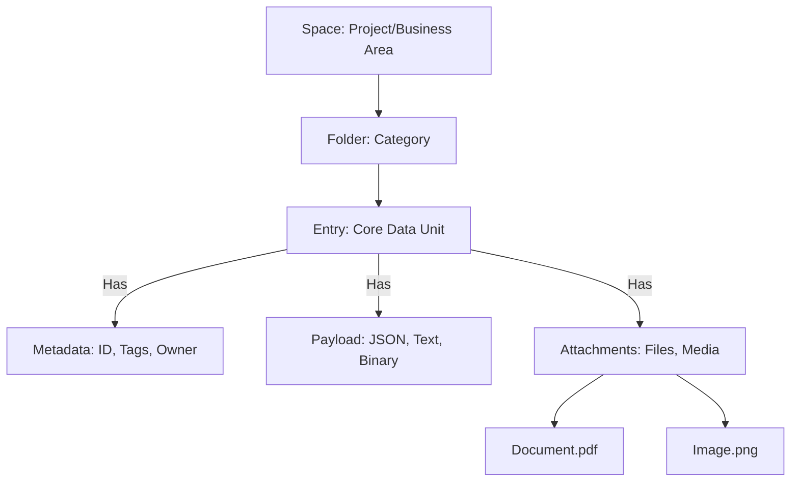
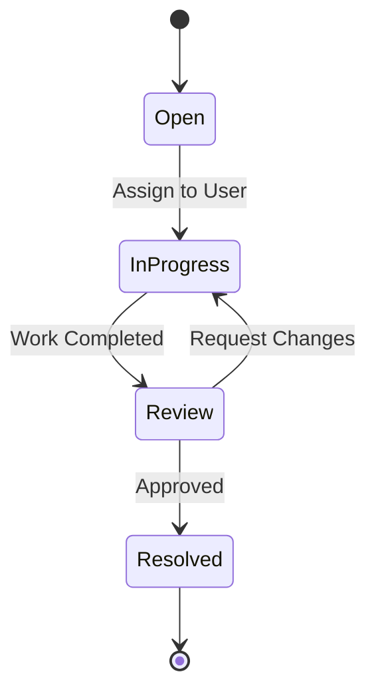
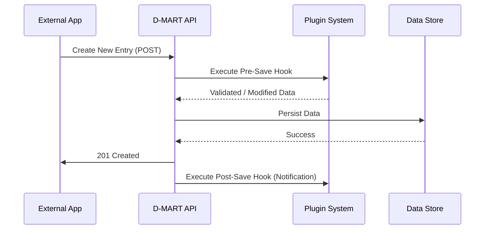

# D-MART Feature Overview

D-MART is a versatile Data-as-a-Service (DaaS) platform designed to simplify data management for modern applications. It acts as a central repository for structured data, documents, and media, providing a unified interface for storage, retrieval, and collaboration. This document outlines the key features and capabilities of D-MART, tailored for project managers and developers.

## Core Capabilities

### 1. Unified Data Management
D-MART treats data as a first-class citizen, moving beyond traditional database constraints.
*   **Flexible "Entries"**: The core unit of data is an "Entry," which can represent anything from a simple record to a complex document.
*   **Structured & Unstructured Data**: Seamlessly handle JSON data (structured) alongside unstructured content like text, markdown, and binary files (images, PDFs, videos).
*   **Attachments**: Associate any number of files (documents, media) directly with an entry, keeping related information together.
*   **Hierarchical Organization**: Organize data into intuitive folder structures (Spaces and Subpaths), similar to a file system, making it easy to browse and manage.

### 2. Powerful Search & Discovery
Finding information is effortless with D-MART's robust search engine.
*   **Full-Text Search**: Instantly search across all data, including structured fields and text content.
*   **Advanced Filtering**: Filter results by tags, creation dates, authors, and specific data attributes.
*   **RediSearch Integration**: Leverages high-performance indexing for lightning-fast query results.

### 3. Collaboration & Workflow Automation
D-MART includes built-in tools to manage processes and teamwork.
*   **Ticketing System**: Transform any data entry into a trackable ticket with states (e.g., "Open," "In Progress," "Resolved").
*   **Custom Workflows**: Define custom state transitions and rules to match your specific business processes.
*   **Assignments**: Assign entries or tickets to specific users or roles.
*   **Comments & Reactions**: Collaborate directly on data entries with threaded comments and emoji reactions.

### 4. Comprehensive Access Control
Security is granular and configurable to match organizational needs.
*   **Spaces**: distinct workspaces to isolate data and projects.
*   **Role-Based Access Control (RBAC)**: Define roles (e.g., Admin, Editor, Viewer) with specific permissions.
*   **Granular Permissions**: Control access at the folder or even individual entry level (Create, Read, Update, Delete).

### 5. Integration & Extensibility
Designed to integrate seamlessly with your existing ecosystem.
*   **RESTful API**: A comprehensive, documented API allows external applications to interact with every aspect of the platform.
*   **Plugin Architecture**: Extend functionality with custom plugins for logic, validation, or external integrations.
*   **Webhooks & Notifications**: Trigger actions or send notifications (Email, SMS) based on data changes or workflow events.

### 6. Deployment & Operations
Built for flexibility and reliability in various environments.
*   **Container-Ready**: Easily deployable via Docker/Podman for consistent environments.
*   **Offline Capability**: Supports air-gapped deployments, allowing data synchronization when connectivity is restored.
*   **File-System Backed**: Data is stored in a human-readable file structure, ensuring data longevity and ease of backup/restoration.
