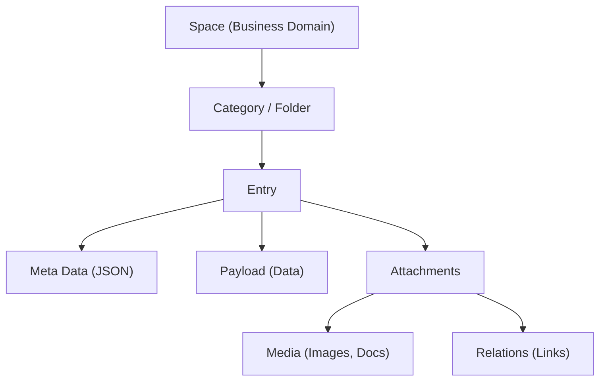
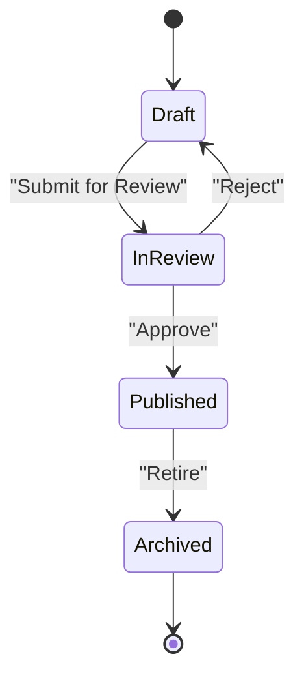

# D-MART Features Overview

D-MART is a "Data-first" platform designed to transform how organizations manage their valuable information. By acting as a universal Data-as-a-Service (DaaS) layer, it provides a centralized backbone where data assets are declared, managed, and consumed across multiple applications and microservices.

This document provides a non-technical overview of D-MART's core capabilities, tailored for project managers, product owners, and developers.

---

## 1. Unified Data Management

D-MART treats information as a commodity. It simplifies the chaos of dispersed data by providing a single source of truth for structured, unstructured, and binary content.

### Key Capabilities:
*   **Entry-Oriented Architecture:** Instead of complex relational tables or isolated NoSQL documents, D-MART organizes data into **entries**. An entry is a coherent information unit that bundles meta-information, structured payloads (JSON), and arbitrary attachments (files, media, relations).
*   **Flexible Storage Options:** D-MART prevents vendor lock-in through its dual persistence modes:
    *   **File System Mode:** Stores data directly as flat files on the disk, making it easily inspectable, versionable, and portable.
    *   **SQL Database Mode:** For environments requiring standard RDBMS integration, D-MART fully supports SQL backends.
*   **Hierarchical Organization:** Entries are neatly organized within custom category structures (folders/subpaths), mapping perfectly to logical business domains.

```mermaid
graph TD
    A["Space (Business Domain)"] --> B["Category / Folder"]
    B --> C["Entry"]
    C --> D["Meta Data (JSON)"]
    C --> E["Payload (Data)"]
    C --> F["Attachments"]
    F --> G["Media (Images, Docs)"]
    F --> H["Relations (Links)"]
```

---

## 2. Advanced Search & Discovery

Finding the right data at the right time is critical. D-MART features a robust, high-performance search engine built on top of Redis (RediSearch).

### Key Capabilities:
*   **Lightning Fast Retrieval:** Entries are automatically indexed for rapid full-text search and complex querying.
*   **Unified Query Syntax:** Whether using File System or SQL storage, developers use the same powerful RediSearch-like syntax (e.g., `@field:value`, ranges, negations) to filter and discover data.
*   **Rich Aggregations:** Generate insights, reports, and dashboards directly from the API by utilizing built-in data aggregation reducers (count, sum, average, distinct).

---

## 3. Configurable Workflows & Activities

D-MART isn't just a static data vault; it's an active system capable of driving business processes.

### Key Capabilities:
*   **State-Machine Tickets:** Define custom workflows using JSON states and transitions. Entries can progress through different stages (e.g., Draft -> Review -> Published).
*   **Activity Tracking:** Every change to an entry is recorded, providing a complete audit trail and history of modifications.
*   **Notifications:** Built-in support to trigger system, email, or SMS notifications when specific events or workflow transitions occur.

```mermaid
stateDiagram-v2
    [*] --> Draft
    Draft --> InReview : "Submit for Review"
    InReview --> Published : "Approve"
    InReview --> Draft : "Reject"
    Published --> Archived : "Retire"
    Archived --> [*]
```

---

## 4. "Batteries Included" Security & Access Control

Building user management from scratch is time-consuming. D-MART includes a comprehensive, enterprise-ready security layer out of the box.

### Key Capabilities:
*   **Role-Based Access Control (RBAC):** Define granular permissions based on user roles and groups.
*   **Resource-Level ACLs:** Control access down to the individual subpath, resource type, or specific action (Create, Read, Update, Delete).
*   **Field-Level Protection:** Prevent users from modifying protected fields in their profiles or payloads.
*   **Optimistic Locking:** Built-in data conflict prevention ensuring changes are applied safely in multi-user environments.

---

## 5. Microservice & Extensibility Friendly

D-MART is designed to be the foundation of a broader ecosystem.

### Key Capabilities:
*   **Standardized REST/JSON API:** A unified API layer simplifies application development. Any frontend or microservice can interact with D-MART using standard HTTP protocols.
*   **Plugin Architecture:** Extend D-MART's core functionality with pre-bundled plugins (e.g., LDAP integration, Redis updates) or write custom Python plugins that react to specific data events.
*   **Shared Authentication:** Additional microservices can securely leverage D-MART's JWT-based user sessions, creating a seamless ecosystem.

---

## Summary

D-MART empowers small to mid-sized businesses to take control of their data. By offering a blend of flexible storage, powerful search, process automation, and robust security, it allows teams to focus on building value-driven applications rather than reinventing backend infrastructure.
