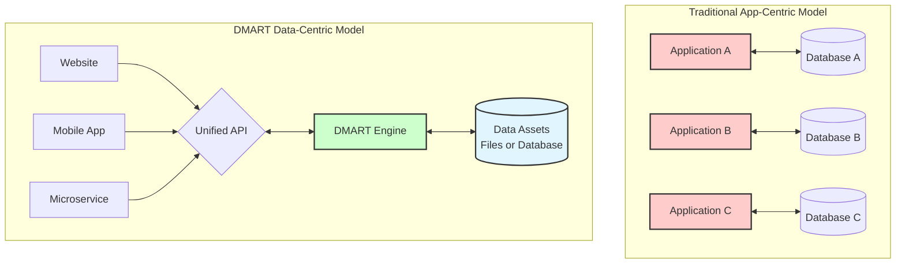
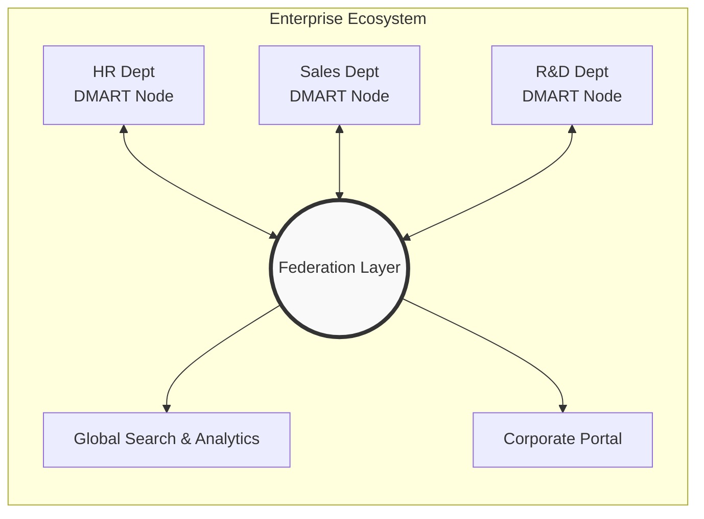

# Why DMART? Unlocking the True Value of Your Data

In today's digital landscape, data is often touted as the "new oil," yet for many organizations, it remains a burden—scattered, locked in proprietary formats, and difficult to manage. **DMART (Data Mart)** changes that narrative.

DMART transforms your data from a liability into a true asset. By treating data as a commodity that is easy to author, share, and extend, DMART empowers businesses of all sizes to regain control over their information. It is not just a database; it is a **Data-as-a-Service (DaaS)** platform designed to streamline how you store, discover, and utilize information.

## The Core Philosophy: Data First

Traditional systems often trap your data inside complex applications. DMART flips this model:

- **Ownership:** Choose between open, human-readable flat files (JSON/Text/Binary) for zero vendor lock-in, or a standard SQL database for enterprise compatibility.
- **Accessibility:** A unified, standardized API layer means any application or microservice can access your data securely, regardless of the underlying storage.
- **Resilience:** Whether file-based or SQL-backed, your data is structured for longevity, version control, and easy inspection.

---

## Tailored Benefits for Every Scale

Whether you are a solo entrepreneur or a large enterprise, DMART adapts to your specific needs, providing value where it matters most.

### 1. Small Business: Agility & Simplicity
For startups, local shops, and independent professionals, technical complexity is the enemy. DMART removes the barriers to entry.

*   **All-in-One Solution:** Use DMART as a backend for your website (CMS), a customer database (CRM), and a product inventory system simultaneously. No need for multiple expensive subscriptions.
*   **Low Maintenance:** With a simple file-based structure and "batteries-included" features like user management and access control, you can focus on your business, not IT overhead.
*   **Cost-Effective:** Deploy easily on standard hardware or cloud instances without worrying about complex database licensing or heavy infrastructure costs.
*   **Rapid Launch:** Quickly spin up a professional online presence with built-in support for content management and messaging.

### 2. Medium Business: Structure & Scalability
As your business grows, so does the chaos of your data. DMART provides the structure needed to scale efficiently without losing agility.

*   **Process Automation:** Leverage built-in workflows and activity management (ticketing) to streamline operations like order processing, support requests, or internal approvals.
*   **Unified Data View:** Consolidate dispersed information into a single "Source of Truth." Link related data (e.g., connecting a Customer entry to their Orders and Support Tickets) easily.
*   **Enhanced Security:** Robust role-based access control (RBAC) ensures that employees only see what they need to see, protecting sensitive company information.
*   **Audit & Compliance:** Every change to an entry is tracked. You have a complete history of who changed what and when, which is crucial for accountability and compliance.

### 3. Big Business: Innovation & Federation
Large enterprises often struggle with "Shadow IT" and the slow pace of corporate IT. DMART serves as an agile layer that complements your core heavy-lifting systems.

*   **Rapid Prototyping:** innovative teams can build and test new internal tools or customer-facing apps in days, not months, bypassing the bureaucratic hurdles of provisioning massive enterprise databases.
*   **Departmental Independence:** Give specific departments (HR, Marketing, R&D) their own DMART instances to manage their specific data needs while remaining compliant with organizational standards.
*   **Microservice Backbone:** Use DMART as a lightweight, flexible operational data store for microservices, allowing them to share a common user session and security model.
*   **Data Federation:** Connect multiple DMART instances to create a federated network of data, allowing seamless collaboration and information sharing across different business units or subsidiaries.
*   **Future-Proofing:** By storing data in standard, open formats, you ensure that your valuable information is never obsolete, regardless of how technology trends shift.

## Conclusion

DMART is more than software; it is a strategic approach to information management. It simplifies the complex, secures the vulnerable, and liberates your data to drive value across your entire organization.

**Stop managing databases. Start managing assets with DMART.**
