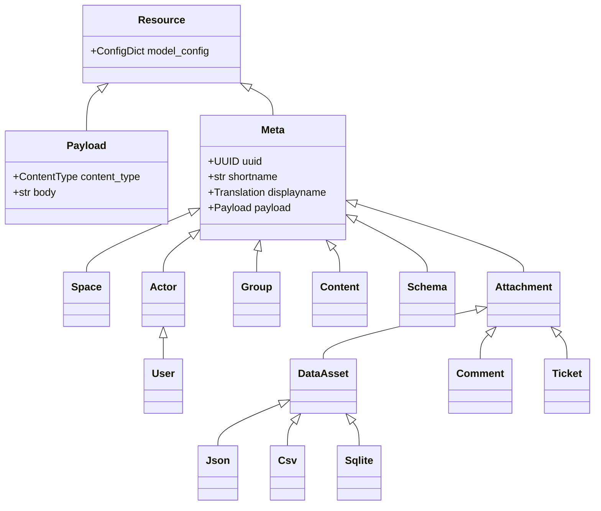
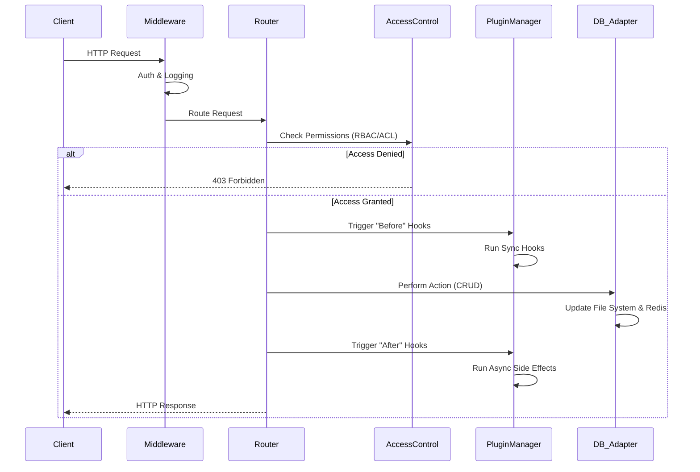

# DMART Technical Overview

## 1. Introduction

DMART (Data Mart) is a Data-as-a-Service (DaaS) platform designed to act as a streamlined, low-code information inventory system. It treats data assets as commodities, allowing for structured, unstructured, and binary data management. It is optimized for small to medium data footprints (<=300 million primary entries) and emphasizes data longevity through flat-file storage, while leveraging Redis for high-performance indexing and search.

## 2. Architecture

DMART follows a microservices-friendly architecture with a clear separation between the API layer, data processing, and storage.

### 2.1 Backend Stack
- **Language:** Python 3.12+ with extensive use of `asyncio` for concurrent request handling.
- **Web Framework:** FastAPI, leveraging Pydantic for data validation and OpenAPI schema generation.
- **ASGI Server:** Hypercorn.
- **Data Persistence:** DMART operates in two distinct modes:
    - **'file' Mode:**
        - **Primary Storage:** Flat-file system (JSON, text, binary) organized in a hierarchical folder structure. This ensures data longevity and easy backup/restoration.
        - **Indexing & Search:** Redis (with RediSearch and RedisJSON modules) is used for high-speed indexing, querying, and caching.
    - **'sql' Mode:**
        - **Primary Storage:** A relational database (e.g., PostgreSQL) serves as the single source of truth, replacing both the file system and Redis.
        - **Indexing & Search:** Handled natively by the SQL database.
- **Authentication:** JWT-based stateless authentication.

```mermaid
graph TD
    User[User / Client] -->|HTTP/REST| LB[Load Balancer / Reverse Proxy]
    LB -->|ASGI| API[FastAPI Backend]

    subgraph "Backend Services"
        API -->|Mode: 'file'| FS[File System Storage]
        API -->|Mode: 'file'| Redis[Redis + RediSearch]
        API -->|Mode: 'sql'| SQL[SQL Database (e.g. PostgreSQL)]
    end

    subgraph "Frontend"
        SPA[Svelte SPA] -->|API Calls| API
        Tauri[Tauri Desktop App] -->|API Calls| API
    end

    FS -->|'file' Mode| Backup[Backup Systems]
    SQL -->|'sql' Mode| Backup
```

### 2.2 Frontend Stack
- **Framework:** Svelte with Vite as the build tool.
- **Routing:** Routify (@roxi/routify).
- **State Management:** Svelte Stores.
- **UI Library:** Flowbite Svelte / SvelteStrap.
- **Desktop App:** Tauri (Rust-based) for building cross-platform desktop applications.

## 3. Core Concepts & Data Model

DMART uses an **Entry-oriented** data model rather than a document-oriented one. All entities inherit from a base `Meta` class.

### 3.1 Resource Hierarchy
- **Space:** The top-level container for content, defining configuration like languages, plugins, and visibility.
- **Subpath:** A logical folder structure within a space (e.g., `/content/posts`).
- **Entry:** The atomic unit of information. Every entry has:
    - **UUID & Shortname:** Unique identifiers.
    - **Meta:** Metadata (display name, description, tags, owner, timestamps).
    - **Payload:** The actual content (JSON body, text, etc.), validated against a schema.
    - **Attachments:** Additional files or data associated with the entry.

### 3.2 Key Data Structures (Pydantic Models)
- **Meta:** Base class containing common attributes (uuid, shortname, slug, acl, etc.).
- **Record:** A flat representation of an entry used for API I/O.
- **Payload:** Encapsulates content type, schema reference, and the body itself.
- **Attachment:** Extends `Meta` for attached resources. Subtypes include `Media`, `Comment`, `Reaction`, `Relationship`.
- **DataAsset:** Specialized attachments for structured data files like `Json`, `Csv`, `Sqlite`, `Duckdb`, `Parquet`.
- **Ticket:** Extends `Meta` to support workflow states, reporters, and collaborators.



## 4. Key Features

### 4.1 Storage & "Data Longevity"
In **'file' mode**, data is stored directly on the file system in a human-readable format:
- **Meta Files:** `[subpath]/.dm/[shortname]/meta.[type].json`
- **Payload Files:** `[subpath]/[payload_file]`
- **Attachments:** Stored within the `.dm` hidden folder structure.
This "flat-file first" approach allows the entire Redis index to be rebuilt from disk at any time (`dmart.py reindex`).

In **'sql' mode**, data is stored in normalized database tables, ensuring ACID compliance and standard relational integrity.

### 4.2 Advanced Search & Querying
The `/query` endpoint supports a rich query language backed by the underlying engine (RediSearch in 'file' mode, SQL in 'sql' mode):
- **Filtering:** By space, subpath, resource type, schema, and specific shortnames.
- **Full-text Search:** Fuzzy matching on text fields.
- **Aggregation:** Grouping and reducing data (e.g., counts, sums).
- **Sorting & Pagination:** `limit`, `offset`, `sort_by`.
- **Specialized Queries:** `history` (audit logs), `events`, `tags`, `reports`.

### 4.3 Access Control (RBAC + ACL)
Security is enforced via a comprehensive `AccessControl` module:
- **Global & Space-Level Permissions:** Defined via `Permission`, `Role`, and `Group` resources in the `management` space.
- **Granular Control:** Permissions can be restricted by:
    - **Action Type:** `create`, `read`, `update`, `delete`, `query`, etc.
    - **Subpath:** Hierarchical access (e.g., access to `/content` implies access to `/content/news`).
    - **Resource Type:** Restrict access to specific types (e.g., `ticket` vs `content`).
    - **Conditions:** Dynamic checks like `own` (resource owner) or `is_active`.
    - **Field-Level Restrictions:** `restricted_fields` and `allowed_fields_values` to control specific data attributes.
- **ACLs:** Individual entries can have an `acl` list for fine-grained, per-instance access overrides.

### 4.4 Workflows & Tickets
DMART includes a ticketing system with state management:
- **Tickets:** Entries that track `state` (e.g., open, in-progress, closed).
- **Workflows:** Define valid transitions between states.
- **Progress Endpoint:** `/progress-ticket` API allows moving a ticket through its workflow, updating state, adding comments, and recording resolutions.

### 4.5 Data Import/Export
- **ZIP Import/Export:** Full spaces can be exported to and imported from ZIP archives, preserving the folder structure.
- **CSV Integration:**
    - **Export:** Query results can be streamed as CSV (`/csv` endpoint).
    - **Import:** Resources can be batch-created from CSV uploads (`/resources_from_csv`), mapping columns to schema fields.

### 4.6 Plugin System
An event-driven plugin architecture allows extending functionality:
- **Types:**
    - **API Plugins:** Register new FastAPI routers/endpoints.
    - **Hook Plugins:** Intercept actions (`before` or `after`) on resources.
- **Filtering:** Hooks can target specific actions, resource types, or subpaths.
- **Lifecycle:** `before_action` hooks can validation or block requests. `after_action` hooks run asynchronously for side effects (notifications, logging).



### 4.7 "Data Asset" Management
DMART natively handles analytical data files:
- Specialized support for **DuckDB** and **SQLite** attachments allows performing SQL queries directly on attached files via the API.
- **Parquet**, **JSONL**, and **CSV** are treated as first-class data citizens.

## 5. API Structure

The API is REST-like and resource-oriented. Key routers include:

- **`/managed`**: Core content management (CRUD, Query, Import/Export).
    - `/request`: Unified endpoint for batch operations (create, update, delete, move, patch).
    - `/query`: Main search endpoint.
    - `/entry`: Retrieve single entry metadata and payload.
    - `/payload`: Retrieve raw content/media.
    - `/import` / `/export`: Bulk data operations.
- **`/user`**: Authentication and profile management (Login, Register, Profile).
- **`/public`**: Read-only access for public content.
- **`/qr`**: QR code generation features.
- **`/info`**: System information and manifest.

## 6. Deployment

DMART is designed to be easily deployed:
- **Containerized:** Docker/Podman images available (`ghcr.io/edraj/dmart`).
- **Environment Variables:** Configuration via `config.env` (DB settings, paths, secrets).
- **Admin Scripts:** Helper scripts for setting passwords, reindexing, and backups.
- **Offline/Airgapped:** Scripts provided to download dependencies for offline installation.
